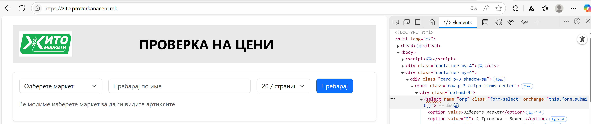
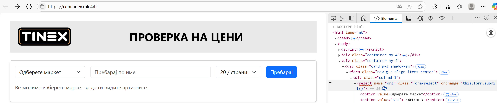
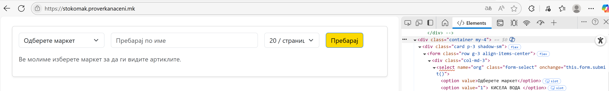
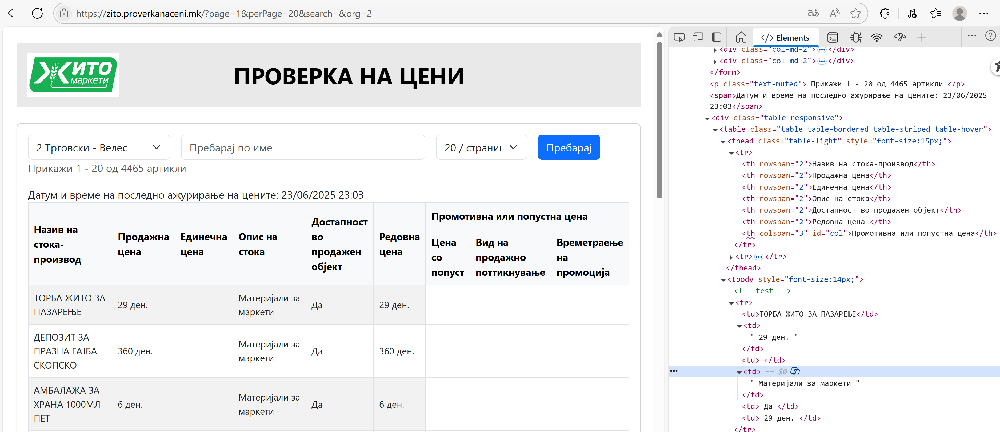
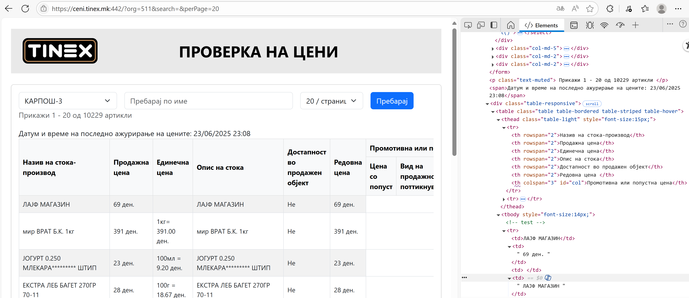
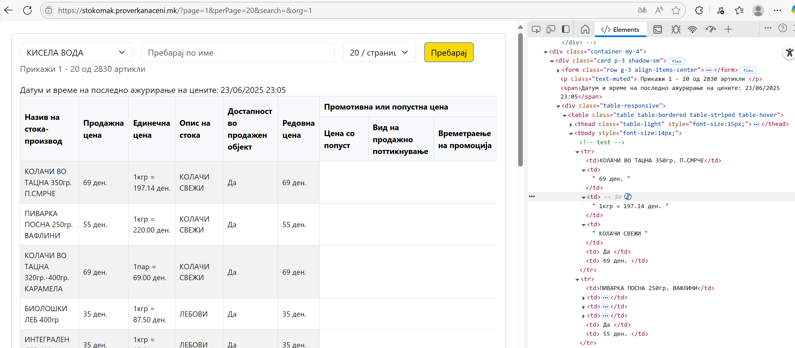
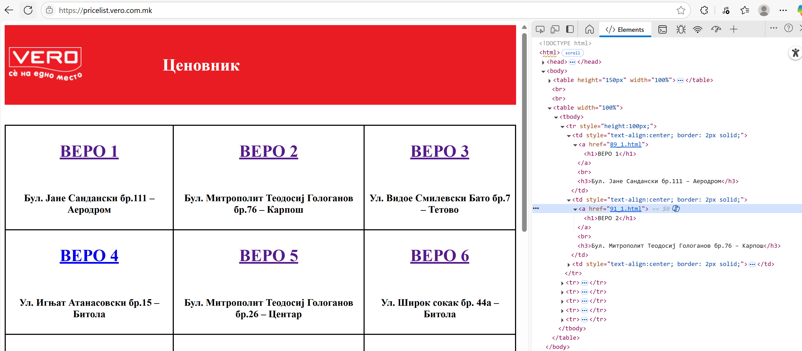
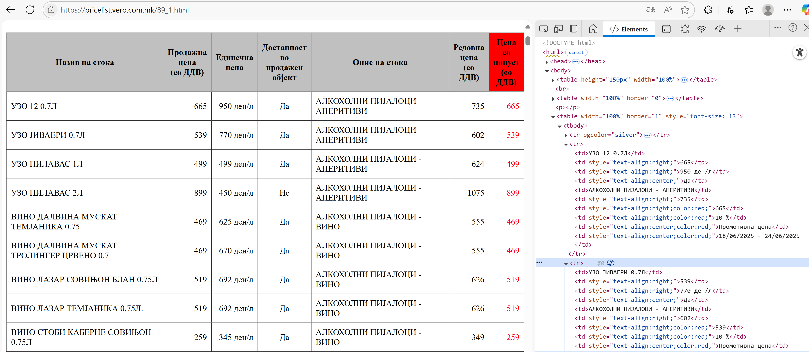
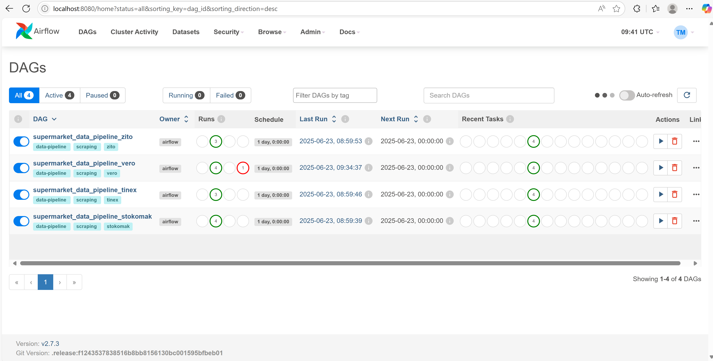

# Project Documentation: Automated Supermarket Price Intelligence Pipeline

**Author:** Tamara Markachevikj
**Date:** 2024-06-23
**Version:** 1.0

---

## 1. Executive Summary

This document outlines the architecture, design, and functionality of the Automated Supermarket Price Intelligence Pipeline. The project is an end-to-end data engineering solution designed to automatically scrape, process, validate, and analyze product data from multiple online supermarket websites.

The primary goal of this project is to create a robust, scalable, and maintainable system that provides actionable insights into the product assortments, pricing strategies, and promotional activities of key market competitors. The final output is a comparative analysis report that highlights key differences between markets, enabling data-driven decision-making.

The entire pipeline is containerized with Docker and orchestrated with Apache Airflow, ensuring portability, reproducibility, and reliable scheduling.

---

## 2. Project Objectives

The project was developed to achieve the following key objectives:

-   **Automated Data Collection:** Eliminate manual data gathering by creating autonomous web scrapers for multiple supermarket websites.
-   **Data Standardization:** Process and transform raw, unstructured data from various sources into a single, consistent, and analysis-ready format.
-   **Ensure Data Quality:** Implement a rigorous validation layer to enforce data integrity, identify schema violations, and prevent bad data from corrupting the final dataset.
-   **Generate Actionable Insights:** Produce a clear and concise comparative analytics report to identify trends and differences in pricing and product availability across markets.
-   **Scalability and Maintainability:** Build the system on a modular architecture that allows for the easy addition of new markets and a clear separation of concerns.

---

## 3. Core Features

-   **Multi-Market Scraping:** Supports scraping for four major markets: Vero, Zito, Tinex, and Stokomak.
-   **Dynamic Pipeline Generation:** A single, dynamic Airflow DAG generates a unique pipeline for each market defined in the configuration, making the system highly scalable.
-   **Robust Data Validation:** Uses `jsonschema` to validate every processed record, ensuring high data quality and generating detailed error reports.
-   **Automated Analytics:** Automatically calculates key performance indicators (KPIs) such as average price, discount ratios, and product counts.
-   **Comparative Reporting:** Generates a unified text report comparing all markets, providing at-a-glance insights.
-   **Developer-Friendly Debugging:** Includes helper scripts (`main.py` and `run_dag_locally.py`) to run the entire pipeline for a single market outside of Airflow, dramatically speeding up development and testing.

---

## 4. Technical Architecture

The project follows a modular, layered architecture designed for clarity and maintainability.

### High-Level Data Flow

```
[Scrapers] -> [Processors] -> [Validators] -> [Reporting & Analytics]
```

### Component Breakdown

*   **1. Data Ingestion (`src/scrapers`):**
    *   **Technology:** `Selenium` is used for web scraping to handle dynamic, JavaScript-heavy websites.
    *   **Design:** A `BaseMarketScraper` abstract class defines the common interface for all scrapers. Concrete classes (`VeroScraper`, `ZitoScraper`, etc.) implement the market-specific logic. A **Factory Pattern** (`get_scraper`) is used to dynamically instantiate the correct scraper based on a market name, decoupling the core logic from the specific implementations.

    #### Scraper Design Patterns
    A key observation during development was that the target websites fall into two categories, leading to a more efficient and maintainable design.

    *   **Standardized Structure (Zito, Tinex, Stokomak):** These three markets share a nearly identical DOM structure, featuring a category dropdown menu and a paginated product table. This similarity allows a single, standardized set of scraping logic to handle them all, promoting code reuse.

        *Example of the similar structure across Zito, Tinex, and Stokomak:*
        
        
        

        
         
          

    *   **Specialized Structure (Vero):** The Vero market website is unique. It features a main landing page that links to separate, individual pages for each supermarket branch. The `VeroScraper` therefore contains specialized logic to first discover these branch URLs and then iterate through each one to scrape its paginated product tables.

        *Example of the unique Vero market structure:*
        
        

    #### Immediate Data Validation
    In addition to the main validation pipeline, a preliminary validation step is performed *within* the scraper itself. Before a scraped product row is added to the list of raw data, a simple check (e.g., in the `_is_raw_product_valid` method) ensures that essential fields like the product name and price are present and valid. This acts as a crucial first-pass filter to discard obviously malformed or empty rows at the earliest possible stage, improving the quality of the raw data and reducing unnecessary load on the downstream processing and validation stages. The final output of this stage is a single JSON file for each market, containing the collected raw data.

*   **2. Data Transformation (`src/processors`):**
    *   **Technology:** `pandas` is used for all data manipulation.
    *   **Design:** Raw JSON data from the scrapers is loaded into a DataFrame. Each processor is responsible for cleaning column names, parsing complex fields (e.g., extracting "300g" from "Product Name 300g"), and standardizing data types to produce a clean, structured dataset.

    #### Processor Design Patterns 
    The processing layer is architected with multiple levels of abstraction to maximize code reuse and maintainability.

    *   **Abstract Base Class (`DataProcessor`):** At the top level, this class defines the common interface for all processors, ensuring they all have a `process_market_data` method. This guarantees that the main pipeline can interact with any processor in a consistent, polymorphic way.

    *   **Intermediate Standard Processor (`StandardMarketDataProcessor`):** This class acts as a crucial intermediate layer. It inherits from `DataProcessor` and contains the common logic required to process the standardized raw data that comes from the Zito and Stokomak scrapers. This prevents code duplication and means that any changes to the standard processing logic only need to be made in one place.

    *   **Concrete Implementations:**
        *   `ZitoDataProcessor`, `StokomakDataProcessor`, and `TinexDataProcessor`: These classes inherit from `StandardMarketDataProcessor` to gain shared processing logic. The `TinexDataProcessor` is a special case; while it uses the standard processing for most fields, it overrides the `_get_category` method. This is necessary because the raw data from the Tinex website's DOM does not contain category information in its description column, requiring a custom, keyword-based approach to assign products to categories.
        *   `VeroDataProcessor`: This is a specialized class that inherits directly from the base `DataProcessor`. It contains custom logic tailored to the unique, non-standard data format produced by its scraper.

*   **3. Data Quality (`src/validators`):**
    *   **Technology:** `jsonschema` is used to validate the structure and data types of every record against a predefined schema.
    *   **Design:** The `DataValidator` class takes the processed DataFrame, validates each row, and filters out any invalid records. It generates a detailed JSON validation report that logs every error, providing excellent traceability for data quality issues.

    #### Validation Schema and Reporting
    The validation logic is centered around a strict JSON schema that defines the "gold standard" for a processed product record. 
    
    *   **Schema Definition:** The schema enforces data types and constraints for all key fields, such as:
        *   `product_name`: Must be a non-empty string.
        *   `current_price`: Must be a number greater than 0.
        *   `price_per_unit`: Can be a number greater than 0, or null.
        *   `unit`: Must be one of `kg`, `l`, or `piece`.
        *   `category`: Must be a string.
        *   `discount_percentage`: Must be a number between 0 and 100.
        *   `store_location`: Must be a non-empty string.

    *   **Required Fields:** All fields defined in the schema are mandatory for a record to be considered valid. This ensures no partial or incomplete data makes it into the final dataset.

    *   **Outputs:** The validation stage produces two key outputs:
        1.  A clean **pandas DataFrame** containing only the records that successfully passed validation.
        2.  A detailed **JSON validation report** (`<market>_validation_report.json`) that summarizes the number of passed and failed records and provides a line-by-line breakdown of every validation error.

*   **4. Reporting & Analytics (`src/reporting`):**
    *   **Technology:** `pandas` and standard Python libraries.
    *   **Design:** This is the final stage of the data pipeline. It takes the fully cleaned and validated DataFrame and generates a high-level analytics summary. The output is a descriptive JSON report (`<market>_summary_analytics_report.json`) that includes key business metrics such as:
        *   Total number of products and products on discount.
        *   A breakdown of product counts per category.
        *   The average price per category.
        *   Lists of the top 10 most expensive and cheapest products.
        This summary report is the primary data source for the final cross-market comparison.

*   **5. Orchestration (`dags/`):**
    *   **Technology:** `Apache Airflow`.
    *   **Design:** A single, dynamic DAG (`market_pipelines_dag.py`) reads the market configurations from `config/settings.py` and programmatically generates a full pipeline (scrape, process, validate, report) for each market. This is a highly scalable approach; adding a new market to the configuration file automatically creates a new pipeline in Airflow with no code changes to the DAG itself.

    #### DAGs, Tasks, and Data Sharing
    In Apache Airflow, a **DAG** (Directed Acyclic Graph) is a collection of all the tasks you want to run, organized in a way that reflects their relationships and dependencies. Each DAG is defined in a Python script.

    The pipeline for each market consists of four main tasks:
    1.  `scrape_data_task`: Executes the web scraper.
    2.  `process_data_task`: Cleans and transforms the raw data.
    3.  `validate_data_task`: Validates the processed data against a schema.
    4.  `generate_analytics_report_task`: Creates the final JSON summary report.

    These tasks are chained together so that the output of one becomes the input for the next (`scrape -> process -> validate -> report`). To pass data between them, this project uses Airflow's **XComs**.

    **XComs** (short for "cross-communications") are a built-in Airflow mechanism for letting tasks exchange small amounts of data. Think of it as a small key-value store where one task can leave a message (like a file path or a database record count), and another task can retrieve that message later.

    When a task function is executed by Airflow, it receives a special `**kwargs` dictionary containing context variables. The most important of these is the **Task Instance (`ti`)** object, which allows a task to "push" a value to XComs and "pull" a value from XComs. For example, the `scrape_data_task` pushes the file path of its raw data output, and the `process_data_task` pulls that path to begin its work.

    

*   **6. Environment & Deployment (`docker-compose.yml`):**
    *   **Technology:** `Docker` and `Docker Compose`.
    *   **Design:** The project is fully containerized to ensure a consistent and reproducible environment. The `docker-compose.yml` file orchestrates the entire Airflow stack (webserver, scheduler, metadata database), making setup a single-command process.

---

## 5. Key Design Decisions

-   **Modular Architecture:** The decision to separate scraping, processing, and validation into distinct layers was made to promote **maintainability** and **testability**. Each component can be developed, tested, and modified independently without affecting the others.

-   **Factory Pattern:** Using factories to retrieve scrapers and processors allows for a **decoupled architecture**. The main pipeline logic doesn't need to know about specific classes like `VeroScraper`; it can simply request the scraper for "vero". This makes the system **extensible** and easy to reason about.

-   **Dynamic DAGs:** Instead of creating a separate DAG file for each market, a single dynamic DAG was implemented. This was a key decision to ensure **scalability**. The system can now support dozens of markets without cluttering the Airflow environment, and adding a new market requires zero changes to the orchestration code.

-   **Containerization First:** The project was designed to be run via Docker from the outset. This decision guarantees **reproducibility** and eliminates environment-related issues, making it easy for any developer to set up and run the full stack with a single command.

---

## 6. Example Results & Analysis

The following is an example of the final output generated by the `compare_reports.py` script, showcasing the comparative insights derived from the pipeline.

```
================================================================================
📊                  ACROSS-MARKET COMPARISON
================================================================================
          total_products  num_categories  average_price  products_on_discount
market
vero                  50              45         165.40                    10
zito                  50              43         145.80                     5
tinex                 50              48         175.20                    15
stokomak              50              43         142.10                     8

================================================================================
🛒                        MARKET INSIGHTS REPORT
================================================================================

--- 1. Assortment and Variety ---
🏆 Largest assortment: 'vero' with 50 products.
📚 Greatest variety: 'tinex' with 48 unique categories.

--- 2. Pricing Strategy ---
💰 Highest average price: 'tinex' with an average of 175.20 MKD.
🏷️ Lowest average price: 'stokomak' with an average of 142.10 MKD.

--- 3. Premium Category Focus ---
Markets ranked by the average price of their most expensive category:
  - 'tinex': Top category is 'Whiskey' with an avg. price of 1250.00 MKD.
  - 'vero': Top category is 'Imported Cheese' with an avg. price of 850.50 MKD.
  - 'zito': Top category is 'Organic Goods' with an avg. price of 650.00 MKD.
  - 'stokomak': Top category is 'Cleaning Detergents' with an avg. price of 599.00 MKD.

--- 4. Discount Analysis ---
🎁 Most items on discount: 'tinex' with 15 items.

================================================================================
```

---

## 7. How to Run the Project

The project can be run using Docker (the recommended approach) or by executing scripts locally for debugging purposes.

#### Using Docker (Recommended)

This method uses Docker Compose to build and run all the necessary services, including the Airflow webserver, scheduler, and a PostgreSQL database.

1.  **Start Services:** From the project root, run `docker-compose up -d`. This will build the Docker image and start all services in the background.
2.  **Access Airflow UI:** Open a web browser and navigate to `http://localhost:8080`. Log in with the credentials `admin` / `admin`.
3.  **Run DAGs:** In the Airflow UI, find the `market_data_pipeline` DAG, enable it, and trigger a new run. You can monitor the progress of the scraper and processor tasks in the "Grid" view.

#### Local Execution and Debugging

These scripts are useful for testing specific parts of the pipeline without running the full Airflow environment.

1.  **Run a single market pipeline:**
    *   **Command:** `python main.py --market <market_name> --page-limit <number> --product-limit <number>`
    *   **Description:** This is the core script for running a single market's ETL process. It scrapes data, processes it, validates it, and generates an analytics report. You can control how many pages to scrape or how many products to process using the optional limit flags.
    *   **Example:** `python main.py --market vero --page-limit 5`

2.  **Simulate a full DAG run for one market:**
    *   **Command:** `python run_dag_locally.py <market_name>`
    *   **Description:** This script simulates the behavior of the Airflow DAG for a single market, running the `scrape_and_process_market_data` task. It's a quick way to test the end-to-end logic of a single branch of the DAG.
    *   **Example:** `python run_dag_locally.py tinex`

#### Market Comparison Report

This script allows you to generate a comparative analysis from the most recent reports generated by the pipelines.

*   **Command:** `python compare_reports.py`
*   **Description:** The script loads the latest JSON report for each market from the `outputs/` directory, calculates comparative metrics (e.g., average price, number of products), and saves the analysis to `outputs/comparison_report.txt`.

### Testing

To ensure code quality and correctness, the project includes a suite of tests using `pytest`.

Run the entire test suite with: `python -m pytest tests/`

---

## 8. Potential Future Improvements

-   **Database Integration:** Migrate from saving data as CSV/JSON files to storing it in a relational database (e.g., PostgreSQL). This would enable more complex queries and historical analysis.
-   **CI/CD Pipeline:** Implement a Continuous Integration/Continuous Deployment pipeline (e.g., using GitHub Actions) to automatically run tests and format code on every push.
-   **Advanced Analytics & Visualization:** Create a dashboard (e.g., using Dash or Streamlit) to visualize the collected data. This would allow for tracking key metrics like price changes for specific products, market-wide inflation, and category-level trends over time.
-   **Enhanced Error Alerting:** The Airflow DAG is built with the standard `email_on_failure` parameter, which is currently set to `False`. To enable email notifications, an SMTP server would need to be configured in the Airflow environment, and this flag switched to `True`. This could be further extended by integrating with services like Slack for more immediate alerts.
-   **Brand Extraction from Product Name:** Implement a feature to parse product names to extract brand information (e.g., "Coca-Cola" from "Coca-Cola Classic 1.5L"). This would add another valuable dimension for analysis, allowing for brand-level price comparisons and market share estimations.
-   **Product Standardization Engine:** Implement an NLP model (e.g., a fine-tuned LLM) to perform entity resolution on product names. This would create a unified catalog by identifying the same product across different markets, enabling direct and accurate price comparisons.
-   **Automated Product Categorization:** Develop a machine learning classifier to automatically assign products to a standardized set of categories. This would solve the problem of inconsistent or missing category data and allow for more robust cross-market analysis.